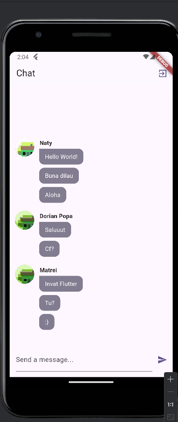
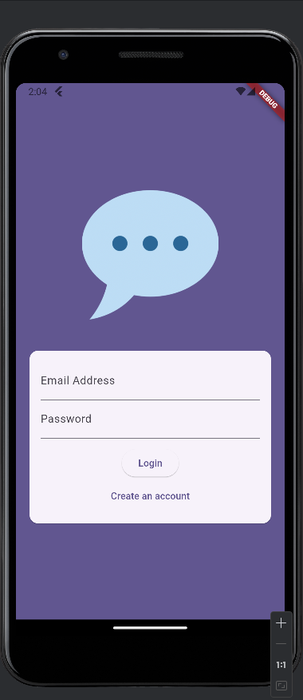
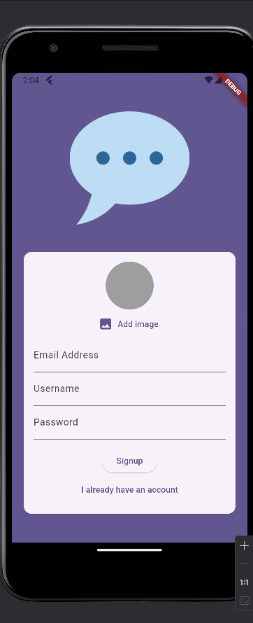

# Global Chat

Application in which I learned:
- Creating/configuring/debugging a Firebase app [Firebase Auth](https://firebase.google.com/docs/auth)
- Working with Firebase CLI
- [NoSQL Firebase Storage](https://firebase.google.com/docs/storage)
- Working with notifications and native features (kind of an observer design pattern)

## Final Result

